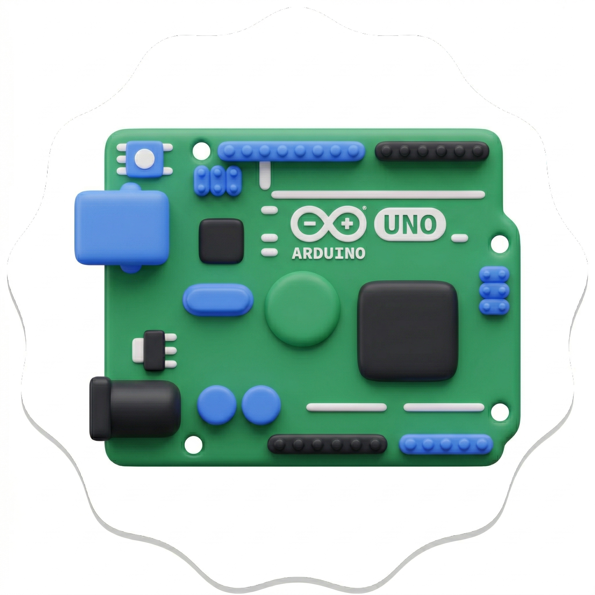

# 🚀 Webduino - IDE de Arduino en tu Navegador (Open Source)

  

  
  
  

**Webduino** es un Entorno de Desarrollo Integrado (IDE) para Arduino **completamente abierto y gratuito** que funciona directamente en tu navegador web. Diseñado para simplificar la programación de hardware, permite compilar y flashear código sin necesidad de instalar software local ni controladores complejos.

🔗 **Acceder a la herramienta:** [https://webduino.infinityfreeapp.com/](https://webduino.infinityfreeapp.com/)

---

## 🛠️ Sobre este Repositorio

¡Este es un proyecto **Free and Open Source Software (FOSS)**! Creemos en la colaboración y en el acceso libre a herramientas educativas. Este repositorio está abierto para que cualquiera pueda proponer mejoras, auditar el código y expandir sus capacidades.

### 🎯 ¿Cómo contribuir?
1. **Reporte de Bugs:** Describe el error y los pasos para reproducirlo abriendo un [Issue](../../issues).
2. **Pull Requests:** ¿Tienes una mejora en el CSS o una nueva función para el flasher? ¡Haz un fork y envía tu propuesta!
3. **Sugerencias:** Propón nuevas placas compatibles o integraciones en la sección de discusiones o issues.

---

## ✨ Características Principales

- **🔌 Flasheo Nativo:** Sube programas directamente por USB a tu Arduino Uno usando **Web Serial API**.
- **☁️ Sincronización:** Guarda y organiza tus sketches en la nube mediante la integración con **Puter.js**.
- **📚 Gestor de Librerías:** Soporte para dependencias de Arduino a través del archivo `libraries.txt`.
- **🛠️ Compilador Cloud:** Verificación y generación de binarios mediante el motor de compilación de Wokwi.
- **📂 Multi-archivo:** Gestión de proyectos complejos con múltiples archivos (`.ino`, `.cpp`, `.h`).
- **💻 Editor Pro:** Basado en **Ace Editor**, con autocompletado y detección visual de errores.
- **📊 Monitor Serie:** Depuración en tiempo real integrada en el panel inferior.

---

## 🚀 Guía Rápida

1. Abre [Webduino](https://webduino.infinityfreeapp.com/) en Google Chrome o Microsoft Edge.
2. Conecta tu Arduino Uno al puerto USB.
3. Haz clic en **"Seleccionar Placa"** y otorga los permisos necesarios en el navegador.
4. Escribe tu código, verifica la sintaxis y presiona **"Subir a Placa"**.

---

## 📂 Estructura del Proyecto

- `index.html`: Interfaz de usuario y lógica principal del IDE.
- `docs.html`: Documentación técnica y guía de usuario.
- `icon.svg.png`: Identidad visual del proyecto.
- `sitemap.xml`: Mapa del sitio para SEO.

---

## 📜 Licencia

Este proyecto está bajo la **Licencia MIT**. Esto significa que eres libre de usarlo, modificarlo y distribuirlo, siempre que mantengas la atribución original. Consulta el archivo `LICENSE` para más detalles.

---

Hecho con ❤️ por la comunidad Maker. ¡Ayúdanos a hacer la programación de hardware más accesible para todos!
